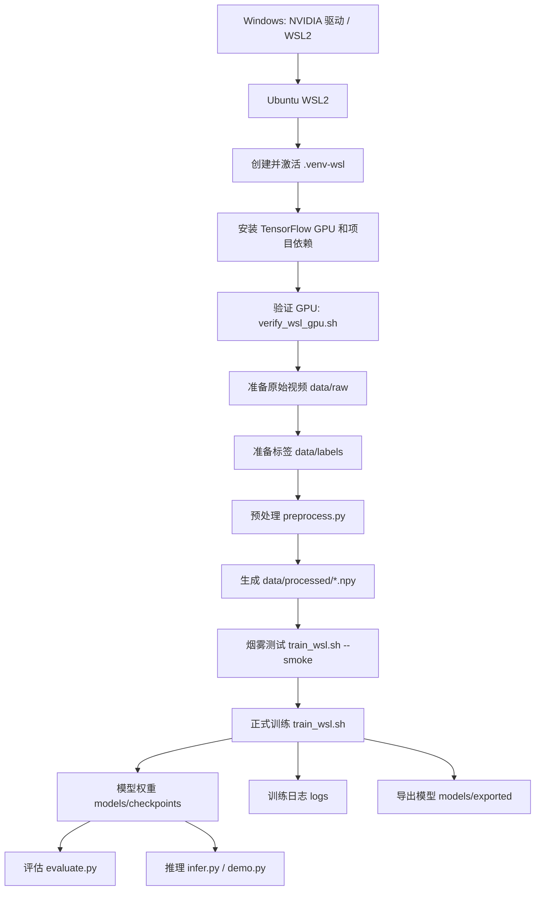
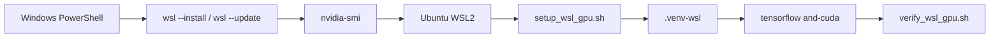
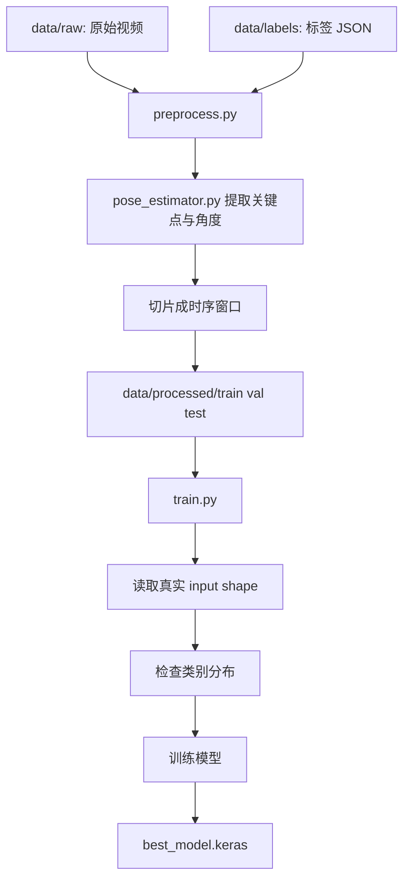
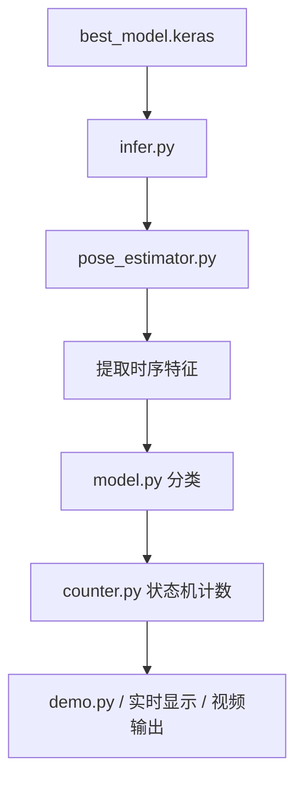

# 项目运行流程图

这份文档描述的是当前项目在接入 Ubuntu WSL2 GPU 训练方案之后的推荐运行路径。

## 总体流程



## 环境流程



## 数据与训练流程



## 推理与使用流程



## 推荐执行顺序

1. Windows 侧确认 `nvidia-smi` 正常
2. Ubuntu WSL2 中运行 `bash scripts/setup_wsl_gpu.sh`
3. 运行 `bash scripts/verify_wsl_gpu.sh`
4. 准备 `data/raw` 和 `data/labels`
5. 执行 `python src/preprocess.py --input data/raw --output data/processed`
6. 先跑 `bash scripts/train_wsl.sh --smoke`
7. 再跑 `bash scripts/train_wsl.sh`
8. 训练后使用 `python src/evaluate.py ...` 做评估
9. 使用 `demo.py` 或 `infer.py` 进行推理和演示

## 关键目录

- `data/raw/`：原始视频
- `data/labels/`：标注 JSON
- `data/processed/`：预处理后的训练数据
- `models/checkpoints/`：训练中保存的模型
- `models/exported/`：导出后的模型
- `logs/`：训练日志
- `scripts/`：WSL GPU 训练辅助脚本
- `docs/`：训练说明、执行计划、流程图

## 最常用命令

```bash
source .venv-wsl/bin/activate
bash scripts/verify_wsl_gpu.sh
python src/preprocess.py --input data/raw --output data/processed
bash scripts/train_wsl.sh --smoke
bash scripts/train_wsl.sh
```

## 当前数据现状提醒

当前仓库里的数据已经推进到双类别：

- [pushup_dataset_labels.json](d:/Programs/VScode/tensor_push_up-main/tensor_push_up-main/data/labels/pushup_dataset_labels.json)
- [jumping_jack_dataset_labels.json](d:/Programs/VScode/tensor_push_up-main/tensor_push_up-main/data/labels/jumping_jack_dataset_labels.json)

当前 `data/processed` 的标签分布已经是：

- `pushup`
- `jumping_jack`

这意味着现在已经可以做有意义的双类别训练。  
如果你后续想要完整支持三分类，还需要再补充 `other` 类视频和标签。
